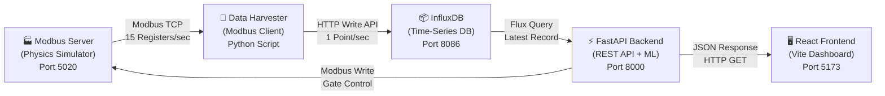
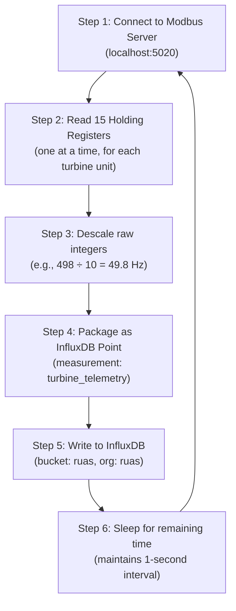
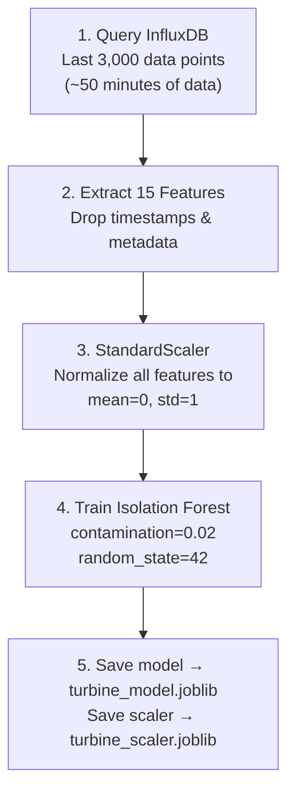
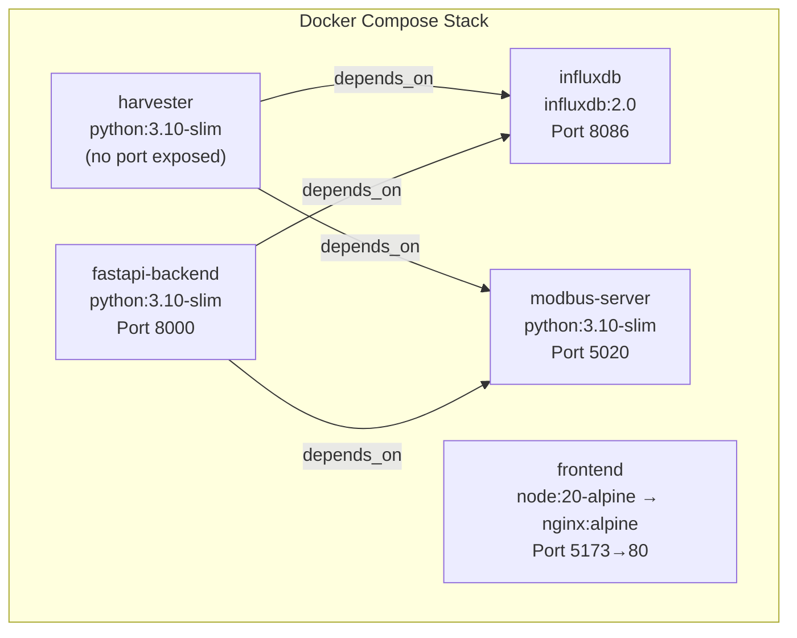

# HYDRO — Complete Project Report
### AI-Powered Predictive Maintenance System for Hydraulic Turbines

---

## 1. Project Overview

**HYDRO** is a full-stack, real-time predictive maintenance platform for **Francis-type hydraulic turbines** used in hydroelectric power plants. The system simulates a real factory environment with virtual sensors, collects data through an industrial protocol (Modbus TCP), stores it in a time-series database (InfluxDB), runs it through a trained Machine Learning model (Isolation Forest), and displays everything on a premium React dashboard.

The goal is simple: **a normal person with no engineering background can look at the dashboard and immediately understand if the turbine is healthy, what's wrong, and what to do about it.**

---

## 2. System Architecture



### Data Flow (Step by Step)

| Step | What Happens | Technology |
|------|-------------|------------|
| 1 | Virtual turbine generates 15 sensor readings every second using physics equations | Python + `pymodbus` |
| 2 | Data Harvester reads these registers via Modbus TCP protocol | Python + `pymodbus` client |
| 3 | Harvester converts raw integers back to physical values (descaling) | Python math |
| 4 | Harvester writes the data point to InfluxDB | `influxdb-client` Python SDK |
| 5 | Frontend polls FastAPI every 1 second asking for latest data | `fetch()` API in React |
| 6 | FastAPI queries InfluxDB for the most recent record | Flux query language |
| 7 | FastAPI feeds the 15 sensor values into the ML model | `scikit-learn` + `joblib` |
| 8 | ML model returns: is this an anomaly? What's the score? | Isolation Forest prediction |
| 9 | FastAPI adds diagnosis + recommended action to the response | Rule-based diagnosis engine |
| 10 | React dashboard renders all data, alerts, charts, and 3D model | React 19 + Three.js |

---

## 3. The Modbus Server (Virtual Sensor / Physics Simulator)

**File**: [modbus_server.py](file:///c:/Users/nishu/Desktop/hydrolic%20turbine/backend/modbus_server.py)
**Port**: `5020`
**Protocol**: Modbus TCP (industrial standard used in real power plants)

### What is Modbus?

Modbus is a **communication protocol** used in industrial machines since 1979. Real hydraulic turbines in power plants use Modbus to send sensor data from the machine to control rooms. Our project simulates this exact protocol so that the system could connect to a **real turbine** with zero code changes.

### How Do Sensors Give Values?

In a real power plant, physical sensors (temperature probes, vibration accelerometers, flow meters) are wired to a **PLC** (Programmable Logic Controller). The PLC stores sensor values in numbered **"Holding Registers"** (like numbered memory slots). Our Modbus server simulates this by calculating physics-based values and writing them into 15 registers every second.

### The 15 Sensor Registers

| Register | Sensor Name | Unit | Scaling | What It Measures |
|----------|------------|------|---------|-----------------|
| 0 | `rotational_speed_rpm` | RPM | ×1 | How fast the turbine runner is spinning |
| 1 | `active_power_mw` | MW | ×10 | Real electrical power being generated |
| 2 | `reactive_power_mvar` | MVAR | ×10 | Reactive (non-useful) power component |
| 3 | `frequency_hz` | Hz | ×10 | Grid electrical frequency (should be ~50 Hz) |
| 4 | `water_flow_rate_m3s` | m³/s | ×10 | Volume of water flowing through per second |
| 5 | `net_head_m` | m | ×10 | Height difference between reservoir and outlet |
| 6 | `wicket_gate_opening_pct` | % | ×10 | How open the water intake gates are |
| 7 | `vibration_mms` | mm/s | ×100 | Mechanical vibration on the turbine shaft |
| 8 | `shaft_runout_mm` | mm | ×100 | How much the shaft wobbles while spinning |
| 9 | `bearing_temp_c` | °C | ×10 | Temperature of the main bearing |
| 10 | `air_gap_mm` | mm | ×10 | Gap between rotor and stator |
| 11 | `draft_tube_pressure_bar` | bar | ×100 | Water pressure in the exit tube |
| 12 | `cooling_water_flow_ls` | L/s | ×10 | Cooling system water flow |
| 13 | `stator_winding_temp_c` | °C | ×10 | Temperature of generator copper windings |
| 14 | `governor_oil_pressure_bar` | bar | ×10 | Hydraulic oil pressure for speed control |

> [!NOTE]
> **Why Scaling?** Modbus registers can only hold integers (0–65535). So a value like `49.8 Hz` is stored as `498` (multiplied by 10). The harvester reverses this (divides by 10) to get back `49.8 Hz`.

### Physics Simulation — How Values Are Calculated

The simulator doesn't generate random numbers. It uses **real physics relationships** between sensors:

```
Power Demand → controls → Wicket Gate Opening → controls → Water Flow Rate
Water Flow Rate → affects → Net Head (Bernoulli's principle)
RPM → determines → Frequency (f = RPM/60 × pole pairs)
Vibration → correlates with → Shaft Run-out (mechanical coupling)
```

**Key physics couplings in the code:**
- `gate_opening = (power_demand / 150.0) × 100%` — Gate opens wider when more power is needed
- `flow_rate = gate_opening × 1.06` — More gate = more water
- `frequency = (rpm / 300.0) × 50.0` — Frequency is locked to speed
- `shaft_runout = 0.15 + (vibration × 0.01)` — More vibration = more wobble
- `net_head = 150.0 - (flow_rate × 0.05)` — More flow = slightly less head

### The 3-State Fault Machine

The simulator cycles through 3 states, each lasting **2 minutes** (120 seconds), creating a 6-minute repeating cycle:

| State | Duration | What Happens | Effect on Sensors |
|-------|----------|-------------|------------------|
| **NORMAL** | 0–120s | Healthy operation | All values in safe range |
| **BEARING DEGRADATION** | 120–240s | Slow mechanical fault | Bearing temp slowly rises +15°C, vibration increases +2.0 mm/s over 60s |
| **CAVITATION** | 240–360s | Sudden hydraulic fault | Vibration spikes +5.0 mm/s, draft tube pressure fluctuates wildly, power drops 10% |

> [!IMPORTANT]
> **Two turbines** run simultaneously (`unit_id=1` and `unit_id=2`), offset in time by 3700 seconds so they are in different fault states at any given moment. This lets you compare a healthy turbine with a faulty one.

---

## 4. The Data Harvester (Bridge Between Machine and Database)

**File**: [data_harvester.py](file:///c:/Users/nishu/Desktop/hydrolic%20turbine/backend/data_harvester.py)

### What is the Data Harvester?

The Data Harvester is a **Python script** that acts as the bridge between the Modbus server (the machine) and InfluxDB (the database). It runs in an infinite loop, performing these steps every 1 second:



### Descaling Logic

The harvester reverses the Modbus scaling:

```python
"rotational_speed_rpm":      float(raw_registers[0]),       # ÷ 1 (no scaling)
"active_power_mw":           raw_registers[1]  / 10.0,      # ÷ 10
"vibration_mms":             raw_registers[7]  / 100.0,     # ÷ 100
"draft_tube_pressure_bar":   raw_registers[11] / 100.0,     # ÷ 100
```

### Why Not Read Directly from the Simulator?

In a real power plant, the Modbus server is the **machine itself** (a PLC bolted to the turbine). You cannot "import" data from it directly — you must use the Modbus TCP protocol over a network connection. Our harvester simulates this industrial reality.

---

## 5. InfluxDB (Time-Series Database)

**Port**: `8086`
**Version**: InfluxDB v2
**Binary**: [influxd.exe](file:///c:/Users/nishu/Desktop/hydrolic%20turbine/influxd.exe) (115 MB, runs locally)

### What is InfluxDB?

InfluxDB is a **time-series database** — a specialized database designed for data that arrives with timestamps at regular intervals (like sensor readings every second). Unlike MySQL or PostgreSQL (which store rows in tables), InfluxDB is optimized for:

- **High write throughput**: Can handle millions of data points per second
- **Time-based queries**: "Give me the last 1 hour of vibration data" is extremely fast
- **Automatic retention**: Old data can be automatically deleted after a set period
- **Compression**: Time-series data compresses very well (10× smaller than SQL)

### Why Not Use MySQL/PostgreSQL?

| Feature | MySQL/PostgreSQL | InfluxDB |
|---------|-----------------|----------|
| Write speed | ~10,000 points/sec | ~1,000,000 points/sec |
| Query "last 1 hour" | Full table scan (slow) | Indexed by time (instant) |
| Storage for 1 year of 1-sec data | ~50 GB | ~5 GB (compressed) |
| Built for | Transactions, user data | Sensor data, metrics, IoT |

### Our InfluxDB Configuration

| Setting | Value |
|---------|-------|
| Organization | `ruas` |
| Bucket (like a "database") | `ruas` |
| Measurement (like a "table") | `turbine_telemetry` |
| Tags | `unit` (e.g., `turbine_01`, `turbine_02`) |
| Fields | All 15 sensor values |
| Timestamp precision | Nanoseconds |

### How Data is Queried (Flux Language)

InfluxDB uses a query language called **Flux** (not SQL). Here's the query our FastAPI backend runs:

```flux
from(bucket: "ruas")
    |> range(start: -1h)                                    // Last 1 hour
    |> filter(fn: (r) => r["_measurement"] == "turbine_telemetry" 
                      and r["unit"] == "turbine_01")        // Specific turbine
    |> last()                                                // Most recent only
    |> pivot(rowKey:["_time"], columnKey: ["_field"], 
             valueColumn: "_value")                          // Flatten into 1 row
```

This returns a single JSON object with all 15 sensor values from the most recent reading.

---

## 6. The ML Model (Anomaly Detection)

**Training Script**: [train_model.py](file:///c:/Users/nishu/Desktop/hydrolic%20turbine/backend/train_model.py)
**Saved Model**: [turbine_model.joblib](file:///c:/Users/nishu/Desktop/hydrolic%20turbine/backend/turbine_model.joblib) (1.3 MB)
**Saved Scaler**: [turbine_scaler.joblib](file:///c:/Users/nishu/Desktop/hydrolic%20turbine/backend/turbine_scaler.joblib) (1.5 KB)

### What Algorithm is Used?

**Isolation Forest** — an unsupervised machine learning algorithm from `scikit-learn`.

### How Does Isolation Forest Work? (Simple Explanation)

Imagine you have a room full of 100 people. 98 of them are standing in a group in the center. 2 of them are standing alone in the corners. If you wanted to "isolate" (separate) one person from the group:

- **Normal people** (in the center group): You need many steps to separate them because they're surrounded by others
- **Anomalous people** (in the corners): You can isolate them in just 1–2 steps because they're already alone

Isolation Forest works the same way with data. It builds many random "decision trees" that try to isolate each data point. Points that get isolated quickly (in fewer tree splits) are **anomalies**.

### What Values Are Used to Train the Model?

The model is trained on **all 15 sensor values simultaneously**:

```python
features = [
    'rotational_speed_rpm',      # How fast the turbine spins
    'active_power_mw',           # How much electricity it generates
    'reactive_power_mvar',       # Non-useful power component
    'frequency_hz',              # Grid frequency
    'water_flow_rate_m3s',       # Water volume flowing through
    'net_head_m',                # Water height difference
    'wicket_gate_opening_pct',   # How open the gates are
    'vibration_mms',             # Mechanical vibration
    'shaft_runout_mm',           # Shaft wobble
    'bearing_temp_c',            # Bearing temperature
    'air_gap_mm',                # Rotor-stator gap
    'draft_tube_pressure_bar',   # Exit tube pressure
    'cooling_water_flow_ls',     # Cooling system flow
    'stator_winding_temp_c',     # Generator winding temperature
    'governor_oil_pressure_bar'  # Speed controller oil pressure
]
```

### Training Process



### Model Hyperparameters

| Parameter | Value | What It Means |
|-----------|-------|---------------|
| `contamination` | `0.02` (2%) | The model expects 2% of data to be anomalous |
| `random_state` | `42` | Fixed seed for reproducibility |
| `n_estimators` | `100` (default) | Number of isolation trees in the forest |
| `max_samples` | `auto` (default) | Number of samples per tree = min(256, n_samples) |

### How Does It Predict? (At Runtime)

Every second, when the frontend asks for data:

1. FastAPI gets the latest 15 sensor values from InfluxDB
2. The **StandardScaler** normalizes them (same scaling used during training)
3. The **Isolation Forest** calculates an **anomaly score** for this data point
4. If `prediction == -1` → **ANOMALY DETECTED**
5. If `prediction == 1` → **SYSTEM HEALTHY**

### On What Basis Does It Predict?

The model learns the **"normal shape"** of all 15 sensors working together. For example, it learns that:
- When power is 120 MW, vibration should be around 3.25 mm/s
- When bearing temp is 65°C, stator temp is usually around 85°C
- When gate opening is 80%, flow rate should be ~85 m³/s

If ANY of these relationships break (e.g., vibration suddenly jumps to 8 mm/s while everything else is normal), the model flags it as an anomaly because it **doesn't fit the learned pattern**.

### The Diagnosis Engine

After the ML model detects an anomaly, a **rule-based diagnosis function** examines *which* sensors are out of range to determine the root cause:

```python
# Cavitation check
if vibration > 4.5 and (draft_pressure > 1.5 or draft_pressure < 0.8):
    return "Cavitation Detected"

# Bearing overheating check
if bearing_temp > 75.0:
    return "Bearing Overheating / Degradation"

# Speed governor failure check
if rpm > 310 or rpm < 290:
    return "Speed Governor Failure"
```

---

## 7. The FastAPI Backend (REST API + ML Engine)

**File**: [fast_api.py](file:///c:/Users/nishu/Desktop/hydrolic%20turbine/backend/fast_api.py)
**Port**: `8000`
**Framework**: FastAPI (Python)

### What is FastAPI?

FastAPI is a modern Python web framework for building REST APIs. It's extremely fast (as fast as Node.js) and auto-generates API documentation.

### API Endpoints

#### `GET /api/live-data?unit=turbine_01`

Returns the latest sensor readings + ML predictions as JSON:

```json
{
    "rotational_speed_rpm": 300.0,
    "active_power_mw": 120.5,
    "vibration_mms": 3.42,
    "bearing_temp_c": 65.3,
    "...": "...all 15 sensors...",
    "timestamp": "2026-06-29T02:30:00Z",
    "ml_insights": {
        "is_anomaly": true,
        "anomaly_score": -0.234,
        "status_message": "CRITICAL: Anomaly Detected!",
        "diagnosis": "Cavitation Detected",
        "action_required": "CRITICAL: Reduce Wicket Gate opening immediately to stabilize pressure."
    }
}
```

#### `POST /api/control-gate`

Two-way SCADA control — sends a command back to the Modbus server to change the wicket gate opening:

```json
{
    "gate_opening_percentage": 75.0,
    "unit": "turbine_01"
}
```

This writes to **Modbus Register 6** (wicket gate) on the server, simulating a real operator adjusting the turbine's water intake from the dashboard.

### CORS Configuration

The backend allows requests from:
- `http://localhost:3000` (Create React App)
- `http://localhost:5173` (Vite dev server)

### Alert Logging

When an anomaly is detected, the system writes to [alerts.log](file:///c:/Users/nishu/Desktop/hydrolic%20turbine/backend/alerts.log) with a **60-second debounce** (max 1 alert per minute per turbine unit):

```
[2026-06-29 02:30:15] SMS ALERT SENT -> URGENT [turbine_01]: Cavitation Detected. CRITICAL: Reduce Wicket Gate opening immediately.
```

---

## 8. The React Frontend (Dashboard)

**Framework**: React 19 + Vite 8
**UI Library**: Ant Design 6
**Charts**: @ant-design/charts 2
**3D Engine**: Three.js + React Three Fiber 9
**Styling**: TailwindCSS 4
**PDF Export**: html2pdf.js

### Frontend Architecture

**Main App**: [App.jsx](file:///c:/Users/nishu/Desktop/hydrolic%20turbine/frontend/src/App.jsx) — The root component that manages:
- Global state (latest data, history, connection status)
- 1-second polling loop to the FastAPI backend
- Page navigation (6 pages)
- Alert stabilization (2-minute hysteresis to prevent flickering)

### All 16 Frontend Components

| # | Component | File | Purpose |
|---|-----------|------|---------|
| 1 | **App** | [App.jsx](file:///c:/Users/nishu/Desktop/hydrolic%20turbine/frontend/src/App.jsx) | Root component, state management, routing, polling |
| 2 | **StatusStrip** | [StatusStrip.jsx](file:///c:/Users/nishu/Desktop/hydrolic%20turbine/frontend/src/components/StatusStrip.jsx) | Top row of 5 key metrics (Power, Speed, Flow, Head, Frequency) |
| 3 | **MetricCard** | [MetricCard.jsx](file:///c:/Users/nishu/Desktop/hydrolic%20turbine/frontend/src/components/MetricCard.jsx) | Individual sensor value display with status coloring |
| 4 | **KPIPanel** | [KPIPanel.jsx](file:///c:/Users/nishu/Desktop/hydrolic%20turbine/frontend/src/components/KPIPanel.jsx) | Key Performance Indicators (Radar + Donut charts) |
| 5 | **TabbedChart** | [TabbedChart.jsx](file:///c:/Users/nishu/Desktop/hydrolic%20turbine/frontend/src/components/TabbedChart.jsx) | Multi-tab time-series line charts (Vibration, Power, Bearing, Flow, Frequency) |
| 6 | **AlertsPanel** | [AlertsPanel.jsx](file:///c:/Users/nishu/Desktop/hydrolic%20turbine/frontend/src/components/AlertsPanel.jsx) | Compact alerts list for sidebar |
| 7 | **AnomalyPanel** | [AnomalyPanel.jsx](file:///c:/Users/nishu/Desktop/hydrolic%20turbine/frontend/src/components/AnomalyPanel.jsx) | ML anomaly status display |
| 8 | **Sidebar** | [Sidebar.jsx](file:///c:/Users/nishu/Desktop/hydrolic%20turbine/frontend/src/components/Sidebar.jsx) | Right sidebar with alerts + anomaly panel |
| 9 | **SidebarLeft** | [SidebarLeft.jsx](file:///c:/Users/nishu/Desktop/hydrolic%20turbine/frontend/src/components/SidebarLeft.jsx) | Left sidebar with quick navigation |
| 10 | **DiagnosticPanel** | [DiagnosticPanel.jsx](file:///c:/Users/nishu/Desktop/hydrolic%20turbine/frontend/src/components/DiagnosticPanel.jsx) | AI diagnosis details panel |
| 11 | **GateControlPanel** | [GateControlPanel.jsx](file:///c:/Users/nishu/Desktop/hydrolic%20turbine/frontend/src/components/GateControlPanel.jsx) | SCADA control — slider to adjust wicket gate + live response chart |
| 12 | **AiAlertsPage** | [AiAlertsPage.jsx](file:///c:/Users/nishu/Desktop/hydrolic%20turbine/frontend/src/components/AiAlertsPage.jsx) | Full AI & Alerts page — clickable alerts with deep diagnostics |
| 13 | **AiRecommendationsPage** | [AiRecommendationsPage.jsx](file:///c:/Users/nishu/Desktop/hydrolic%20turbine/frontend/src/components/AiRecommendationsPage.jsx) | AI Recommendations — simplified diagnostics for non-engineers |
| 14 | **Charts (Analytics)** | [Charts.jsx](file:///c:/Users/nishu/Desktop/hydrolic%20turbine/frontend/src/components/Charts.jsx) | Deep analytics — Radar, Donut, Scatter, and custom visualizations |
| 15 | **ReportGenerator** | [ReportGenerator.jsx](file:///c:/Users/nishu/Desktop/hydrolic%20turbine/frontend/src/components/ReportGenerator.jsx) | One-click PDF report generation |
| 16 | **TurbineModel3D** | [TurbineModel3D.jsx](file:///c:/Users/nishu/Desktop/hydrolic%20turbine/frontend/src/components/TurbineModel3D.jsx) | Full 3D interactive model — dam, penstock, Francis turbine, water particles |

### The 6 Dashboard Pages

| Page | Nav Label | What It Shows |
|------|-----------|--------------|
| 1. Dashboard | `Dashboard` | Status strip, Financial widget, Secondary sensors, KPI panel, Monitored parameters |
| 2. SCADA Control | `SCADA Control` | Wicket gate slider, connection status, real-time response trends |
| 3. AI & Alerts | `AI & Alerts` | Clickable alert list + diagnostic panel (root cause, fix steps, timeline, cost) |
| 4. AI Recommendations | `AI Recommendations` | Simplified AI thinking, turbine status gauge, stress chart, parts analysis |
| 5. Analytics | `Analytics` | Deep charts, time-series trends, and PDF report export |
| 6. 3D Model | `3D Model` | Interactive 3D Francis turbine with concrete dam, penstock, and water particles |

### Alert Threshold System

Defined in [config.js](file:///c:/Users/nishu/Desktop/hydrolic%20turbine/frontend/src/config.js):

| Sensor | Warning Threshold | Critical Threshold |
|--------|-------------------|-------------------|
| Vibration | > 3.8 mm/s | > 4.2 mm/s |
| Bearing Temp | > 65.5 °C | > 66.0 °C |
| Stator Temp | > 86.0 °C | > 87.0 °C |
| Shaft Run-out | > 0.18 mm | > 0.20 mm |

### Condition Score Calculation

The dashboard shows a health score out of 100. Deductions:

| Condition | Score Deduction |
|-----------|----------------|
| Vibration > Critical | -18 points |
| Vibration > Warning | -8 points |
| Bearing Temp > Critical | -14 points |
| Bearing Temp > Warning | -6 points |
| Stator Temp > Warning | -6 points |
| Shaft Run-out > Warning | -5 points |

### Alert Stabilization (Hysteresis)

To prevent alerts from flickering on/off every second when values hover near thresholds, we implemented a **2-minute latch** in App.jsx:
- When an alert triggers, it stays visible for at least **120 seconds**
- When the ML model detects an anomaly, it remains "anomalous" for at least **120 seconds**
- This gives operators time to read and act on alerts without the UI flashing

---

## 9. The 3D Turbine Model

**File**: [TurbineModel3D.jsx](file:///c:/Users/nishu/Desktop/hydrolic%20turbine/frontend/src/components/TurbineModel3D.jsx) (27 KB)
**Engine**: Three.js via `@react-three/fiber` and `@react-three/drei`

### What's Rendered

| Element | Description |
|---------|------------|
| **Gravity Dam** | Massive concrete wall (grey) with trapezoidal cross-section |
| **Reservoir** | Animated blue water surface behind the dam |
| **Penstock** | Large pipe carrying water from reservoir to turbine |
| **Trash Rack / Intake** | Grid at the penstock entrance |
| **Reinforcement Rings** | Metal bands around the penstock |
| **Francis Turbine Runner** | Hydrofoil-shaped blades that spin based on live RPM data |
| **Wicket Gates** | Aerodynamic guide vanes around the runner |
| **Draft Tube** | Exit pipe below the turbine |
| **Water Particles** | 4,000 animated blue particles following the water path (reservoir → penstock → vortex → draft tube) |
| **Downstream Pool** | Water surface below the dam |

### Performance Optimization

- Uses `instancedMesh` for 4,000 water particles (renders as 1 draw call instead of 4,000)
- Particle positions are calculated in the `useFrame` render loop for smooth 60fps animation

---

## 10. Docker Deployment

**File**: [docker-compose.yml](file:///c:/Users/nishu/Desktop/hydrolic%20turbine/docker-compose.yml)

### 5 Docker Containers



| Container | Image | Purpose | Exposed Port |
|-----------|-------|---------|-------------|
| `turbine_influx` | `influxdb:2.0` | Time-series database | `8086` |
| `turbine_physics` | `python:3.10-slim` | Modbus sensor simulator | `5020` |
| `turbine_harvester` | `python:3.10-slim` | Data bridge (Modbus → InfluxDB) | None |
| `turbine_api` | `python:3.10-slim` | FastAPI + ML backend | `8000` |
| `turbine_dashboard` | `node:20 → nginx:alpine` | React dashboard (multi-stage build) | `5173→80` |

### Backend Dockerfile

[Dockerfile (Backend)](file:///c:/Users/nishu/Desktop/hydrolic%20turbine/backend/Dockerfile):
- Base: `python:3.10-slim`
- Installs: `fastapi`, `uvicorn`, `influxdb-client`, `pymodbus`, `pandas`, `scikit-learn`, `joblib`
- Contains: All Python scripts + trained model files (`.joblib`)

### Frontend Dockerfile

[Dockerfile (Frontend)](file:///c:/Users/nishu/Desktop/hydrolic%20turbine/frontend/Dockerfile):
- **Stage 1 (Build)**: `node:20-alpine` — runs `npm install` + `npm run build` to create optimized production bundle
- **Stage 2 (Serve)**: `nginx:alpine` — copies the built files into Nginx to serve the static dashboard
- This **multi-stage build** reduces the final image from ~1 GB (with node_modules) to ~30 MB

### InfluxDB Auto-Setup

The docker-compose automatically initializes InfluxDB with:
- Username: `admin`
- Password: `adminpassword`
- Organization: `ruas`
- Bucket: `ruas`
- API Token: (pre-configured, matching all Python scripts)
- Persistent volume: `influxdb-data` (data survives container restarts)

---

## 11. The Start Script (One-Click Launcher)

**File**: [start.ps1](file:///c:/Users/nishu/Desktop/hydrolic%20turbine/start.ps1) (PowerShell)

This script launches ALL 5 services in the correct order with dependency checks:

| Step | Service | Wait Condition |
|------|---------|---------------|
| 0 | Clean up stale processes | Kill anything on ports 8086, 5020, 8000, 5173 |
| 1 | InfluxDB | Wait for port 8086 to respond (up to 20s) |
| 2 | Modbus Server | Wait for port 5020 to respond (up to 10s) |
| 3 | Data Harvester | Wait 2 seconds (no port to check) |
| 4 | FastAPI Backend | Wait for port 8000 to respond (up to 10s) |
| 5 | Frontend (Vite) | Wait 3 seconds, then auto-open browser |

Press **ENTER** to gracefully shut down all services.

---

## 12. Technology Stack Summary

### Backend
| Technology | Version | Purpose |
|-----------|---------|---------|
| Python | 3.10+ | All backend logic |
| FastAPI | latest | REST API framework |
| Uvicorn | latest | ASGI server for FastAPI |
| pymodbus | 3.5.2 | Modbus TCP server & client |
| influxdb-client | latest | InfluxDB Python SDK |
| scikit-learn | 1.3.0 | Isolation Forest ML model |
| joblib | latest | Model serialization |
| pandas | latest | Data processing for training |
| numpy | latest | Numerical operations |

### Frontend
| Technology | Version | Purpose |
|-----------|---------|---------|
| React | 19.2.4 | UI framework |
| Vite | 8.0.4 | Build tool & dev server |
| Ant Design | 6.3.7 | UI component library |
| @ant-design/charts | 2.6.7 | Charts (Line, Column, Radar, Pie) |
| Three.js | 0.184.0 | 3D rendering engine |
| @react-three/fiber | 9.6.1 | React bindings for Three.js |
| @react-three/drei | 10.7.7 | Helper components for R3F |
| TailwindCSS | 4.2.4 | Utility-first CSS |
| html2pdf.js | 0.14.0 | Client-side PDF generation |

### Infrastructure
| Technology | Version | Purpose |
|-----------|---------|---------|
| InfluxDB | 2.0 | Time-series database |
| Docker | latest | Containerization |
| Docker Compose | latest | Multi-container orchestration |
| Nginx | alpine | Production static file server |
| PowerShell | 5.1+ | One-click launcher script |

---

## 13. File Structure

```
hydrolic turbine/
├── backend/
│   ├── modbus_server.py          # Phase 1: Virtual sensor (physics simulator)
│   ├── data_harvester.py         # Phase 2: Modbus → InfluxDB bridge
│   ├── train_model.py            # Phase 3a: ML model training script
│   ├── fast_api.py               # Phase 3b: REST API + ML inference
│   ├── turbine_model.joblib      # Trained Isolation Forest model (1.3 MB)
│   ├── turbine_scaler.joblib     # StandardScaler for feature normalization
│   ├── requirements.txt          # Python dependencies
│   ├── Dockerfile                # Backend container definition
│   └── alerts.log                # SMS alert simulation log
│
├── frontend/
│   ├── src/
│   │   ├── App.jsx               # Root component + state management
│   │   ├── config.js             # Colors, thresholds, helper functions
│   │   ├── theme.js              # Dark theme palette
│   │   ├── index.css             # Global styles
│   │   └── components/
│   │       ├── StatusStrip.jsx          # Top metric strip
│   │       ├── MetricCard.jsx           # Individual sensor card
│   │       ├── KPIPanel.jsx             # Radar + Donut KPI charts
│   │       ├── TabbedChart.jsx          # Multi-tab time-series charts
│   │       ├── AlertsPanel.jsx          # Sidebar alerts list
│   │       ├── AnomalyPanel.jsx         # ML anomaly indicator
│   │       ├── Sidebar.jsx              # Right sidebar container
│   │       ├── SidebarLeft.jsx          # Left navigation sidebar
│   │       ├── DiagnosticPanel.jsx      # AI diagnosis details
│   │       ├── GateControlPanel.jsx     # SCADA wicket gate control
│   │       ├── AiAlertsPage.jsx         # Full alerts page + diagnostics
│   │       ├── AiRecommendationsPage.jsx # Simplified AI recommendations
│   │       ├── Charts.jsx               # Deep analytics charts
│   │       ├── ReportGenerator.jsx      # PDF report export
│   │       ├── TurbineModel3D.jsx       # 3D turbine + dam model
│   │       └── NavBar.jsx               # Navigation bar
│   ├── package.json              # NPM dependencies
│   ├── vite.config.js            # Vite build configuration
│   └── Dockerfile                # Frontend container (multi-stage)
│
├── docker-compose.yml            # 5-container orchestration
├── start.ps1                     # One-click local launcher
├── influxd.exe                   # Local InfluxDB binary (115 MB)
└── project_status.md             # Project status notes
```

---

## 14. How to Run the Project

### Option A: Local Development (Windows)
```powershell
# Just double-click or run:
.\start.ps1

# This launches ALL 5 services automatically
# Dashboard opens at http://localhost:5173
# Press ENTER to stop everything
```

### Option B: Docker (Any OS)
```bash
docker-compose up --build

# Dashboard: http://localhost:5173
# API:       http://localhost:8000/api/live-data
# InfluxDB:  http://localhost:8086
```

### Option C: Retrain the ML Model
```bash
# 1. Let the system run for at least 10 minutes to collect data
# 2. Then run:
cd backend
python train_model.py

# This queries the last 3,000 data points from InfluxDB,
# trains a new Isolation Forest, and saves it as .joblib files
# 3. Restart FastAPI to load the new model
```
