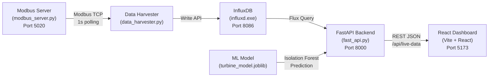

# Virtual Hydraulic Turbine — Project Status Report

> **Date:** April 21, 2026 · **Status:** ✅ Fully Operational

---

## Architecture Overview



---

## Component Status

| # | Component | File | Port | Status |
|---|-----------|------|------|--------|
| 1 | **InfluxDB** | `influxd.exe` | 8086 | ✅ Running |
| 2 | **Modbus TCP Server** | [modbus_server.py](file:///c:/Users/nishu/Desktop/hydrolic%20turbine/backend/modbus_server.py) | 5020 | ✅ Running |
| 3 | **Data Harvester** | [data_harvester.py](file:///c:/Users/nishu/Desktop/hydrolic%20turbine/backend/data_harvester.py) | — | ✅ Running |
| 4 | **FastAPI REST API** | [fast_api.py](file:///c:/Users/nishu/Desktop/hydrolic%20turbine/backend/fast_api.py) | 8000 | ✅ Running |
| 5 | **React Dashboard** | [App.jsx](file:///c:/Users/nishu/Desktop/hydrolic%20turbine/frontend/src/App.jsx) | 5173 | ✅ Running |
| 6 | **ML Model** | `turbine_model.joblib` (1.3 MB) | — | ✅ Loaded |
| 7 | **One-Click Launcher** | [start.ps1](file:///c:/Users/nishu/Desktop/hydrolic%20turbine/start.ps1) | — | ✅ Fixed & Working |

---

## Pipeline Details

### Phase 1 — Modbus Server (Physics Simulation)
- **Simulates** a real hydraulic turbine with 15 telemetry registers updated every 1 second
- **State machine** cycles through 3 modes every 6 minutes:
  - `NORMAL` (0–2 min) — Healthy operation
  - `BEARING DEGRADATION` (2–4 min) — Slow fault: bearing temp +15°C, vibration +2 mm/s
  - `CAVITATION` (4–6 min) — Sudden fault: power drop, erratic vibration +5 mm/s
- **15 registers**: RPM, Active Power, Reactive Power, Frequency, Flow Rate, Net Head, Wicket Gate, Vibration, Shaft Runout, Bearing Temp, Air Gap, Draft Tube Pressure, Cooling Flow, Stator Temp, Governor Oil Pressure

### Phase 2 — Data Harvester
- Polls Modbus server every 1 second
- Descales raw integers back to physical units
- Writes structured data points to InfluxDB bucket `ruas`

### Phase 3 — FastAPI Backend
- Endpoint: `GET /api/live-data`
- Queries InfluxDB for the most recent telemetry record
- Runs **Isolation Forest** ML prediction on each request
- Returns JSON with all sensor values + `ml_insights` (anomaly score, status)

### Phase 4 — React Dashboard
- **Tech stack**: React 19 + Vite 8 + Tailwind CSS 4 + Recharts 3
- **Features**:
  - Real-time live polling (1s interval)
  - Quick stats strip (Power, RPM, Flow, Head, Frequency)
  - Anomaly detection panel (ML-powered)
  - Monitored parameters with threshold-based status (Vibration, Bearing Temp, Stator Temp, Shaft Runout)
  - Trend analysis with tabbed charts (30-point rolling history)
  - Secondary sensors grid (7 additional metrics)
  - Analytics section (Health Radar, Power Bar, Energy Donut)
  - Condition score (0–100)
  - Alert system

### Phase 5 — ML Anomaly Detection
- **Algorithm**: Isolation Forest (scikit-learn)
- **Training data**: 3000 most recent data points from InfluxDB
- **Features**: All 15 telemetry parameters
- **Contamination**: 2% (expected anomaly ratio)
- **Artifacts**: `turbine_model.joblib` + `turbine_scaler.joblib`

---

## Project File Structure

```
hydrolic turbine/
├── start.ps1                    # One-click launcher (starts all 5 services)
├── influxd.exe                  # InfluxDB binary (115 MB)
├── backend/
│   ├── modbus_server.py         # Phase 1: Physics simulation + Modbus TCP
│   ├── data_harvester.py        # Phase 2: Modbus → InfluxDB bridge
│   ├── fast_api.py              # Phase 3: REST API + ML inference
│   ├── train_model.py           # Phase 5: Isolation Forest training
│   ├── turbine_model.joblib     # Trained ML model (1.3 MB)
│   └── turbine_scaler.joblib    # StandardScaler (1.5 KB)
└── frontend/
    ├── package.json             # React 19, Vite 8, Tailwind 4, Recharts 3
    ├── vite.config.js
    └── src/
        ├── App.jsx              # Main dashboard layout
        ├── config.js            # Constants, thresholds, helpers
        ├── index.css            # Global styles (14 KB)
        └── components/
            ├── AnomalyPanel.jsx # ML anomaly detection display
            ├── Charts.jsx       # HealthRadar, PowerBar, EnergyDonut
            ├── MetricCard.jsx   # Reusable sensor metric card
            ├── Sidebar.jsx      # Alerts & condition sidebar
            └── TabbedChart.jsx  # Tabbed trend chart
```

---

## Issues Fixed Today

| Issue | Root Cause | Fix |
|-------|-----------|-----|
| Script prints raw text instead of executing | UTF-8 em-dash characters (`—`) without BOM broke PowerShell 5.1 parser | Replaced with ASCII, saved with UTF-8 BOM |
| `Wait-ForPort` not recognized | Parser failure caused function definition to be skipped | Fixed by encoding fix above |
| `Cannot overwrite variable PID` on cleanup | `$pid` conflicts with PowerShell's read-only `$PID` automatic variable | Renamed to `$procId` / `$procIds` |
| Frontend port 5173 timeout | Stale node process from previous bad cleanup held the port | Added upfront cleanup of all ports on script start |
| Frontend still timing out after cleanup | Vite binds to `[::1]:5173` (IPv6 only), but `TcpClient` checked `127.0.0.1` (IPv4) | Replaced TCP check with 3-second sleep |

---

## How to Run

```powershell
# Start everything (one command):
.\start.ps1

# Press ENTER in the terminal to stop all services

# To retrain the ML model (requires InfluxDB running with data):
python backend\train_model.py
```

> [!TIP]
> The dashboard auto-opens at **http://localhost:5173** when you run `start.ps1`
